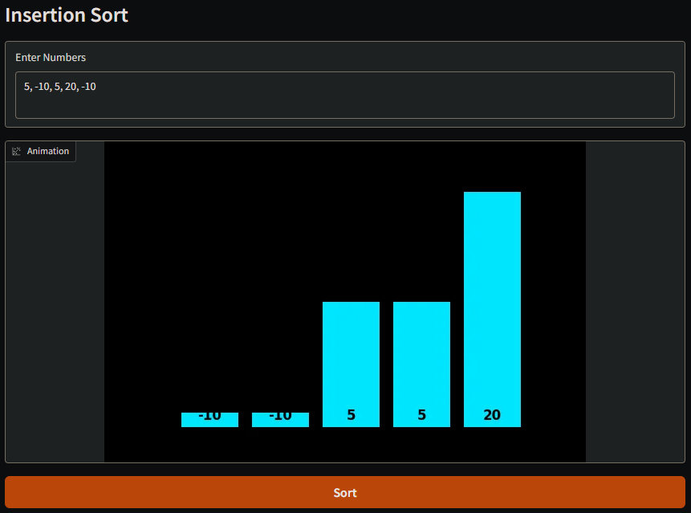

# Algorithm Name: Insertion Sort

I have chosen Insertion Sorting Algorithm as I wanted something more challenging than just reading numbers like in Linear and Binary Search. Insertion Sort requires modifying the list and overall has harder logic that I believe would satisfy the project's suggestion to demonstrate our skills.

## Problem Breakdown & Computational Thinking

**Decomposition:**
We split the problem into two parts: the sorted part which is left side and the unsorted side which is the left.
We take one element at a time from the unsorted side.
It is then compared against the sorted side to find its correct position.
Larger elements are shifted to the right side and the smaller to the left.

**Pattern Recognition:** 
The algorithm is the same logic throughout the entire algorithm but increases the index by 1.
There will be loop that goes through and shifts elements depending on if there bigger or smaller.

**Abstraction:**
We assume that the elements input are only integers to simplify the process.

**Algorithm Design:**
Input: a list of integers
Process: 
 Start from the the second element
 Store the element in a variable
 Compare the variable to the previous element
 If the left element is bigger shift right if not shift left
 Repeat this process until the integers in the list sorted
Output: The same list of integers but sorted

## Testing & Verification 

**Best Case:** 
Input: 1, 2, 3, 4, 5
Since the integers in the list are already sorted it will have a time complexity of On and the program finishes without moving a single piece.

**Worst Case:**
Input: 5, 4, 3, 2, 1
This is the worst possible case of On^2 complexity where all the integers are in reverse order, so it must take longer to solve and it does when tested. 

**Doubles and Negatives:**
Input: 5, -10, 5, 20, -10
Although the code efficiently handled this case the visual was a bit messed up because the negative numbers would make the bar upside down

**The Fix:**
I fixed it by finding a way to normalize the numbers so everytime there is a negative number the rest of the code the numbers representing the bar graphing are shifted up, preventing the columns from hanging upside down.

## Steps to Run
1. **Open the App:** Click the Hugging Face link provided below to open the live application.
2. **Enter Input:** In the "Enter Numbers" text box, type a list of integers separated by commas.
   Example: 6, 1, 3, 15, 10
3. **Start Sorting:** Click the orange Sort button.
4. **Watch the Animation** 

## Demo of Insertion Sort

https://github.com/user-attachments/assets/6407478c-3ac0-4e66-85a9-1d1f381e0ffd

## Hugging Face Link

https://huggingface.co/spaces/Saad121s/Insertion-Sort 

## Author & Acknowledgment
Created by Saad Butt for CISC-121.
